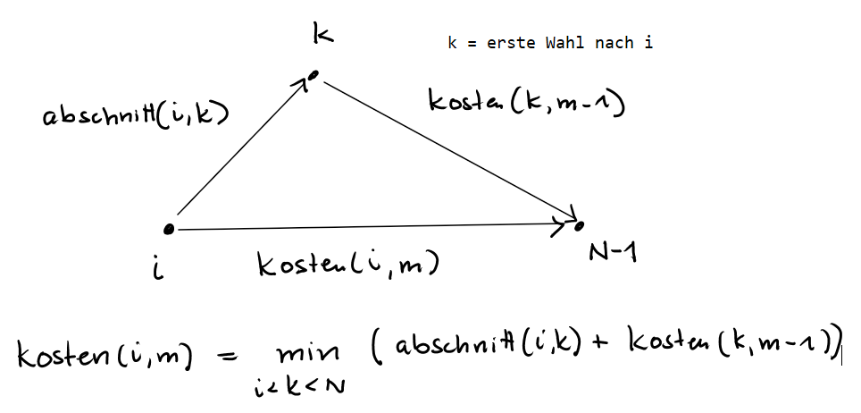

## Voll Daneben

37. Bundeswettbewerb Informatik - Runde 1 - A3

[Aufgabenstellung](./voll_daneben.pdf)

[Lösungshinweise](./voll_daneben_loesungshinweise.pdf)


#### Hinweise zu den Beispieldaten

[Beispieldaten](./beispieldaten/)

Zu dieser Aufgabe gibt es drei Textdateien mit Beispieleingaben.

Jede Datei enthält mehrere Zeilen mit allen Glückszahlen der Teilnehmer einer Runde (eine Glückszahl zwischen 1 und 1000 pro Zeile).


#### Vorüberlegung

Wenn man mehr Zahlen auswählen darf als die Teilnehmerzahlen sind die Kosten 0. Bei kleiner Anzahl
gibt es immer eine optimale Lösung, die nur aus Teilnehmerzahlen besteht. Also kann man sich auf die Auswahl der
Teilnehmerzahlen beschränken.


#### Brute_force Ansatz für kleinere Beispiele zum Ausprobieren:

```
tn = [7,10,14,16,18,19,20,24,26,29,30,32]
m = 5

def minAbstand(x,a):
    '''returns minimaler Abstand von x zu einer Zahl in a'''
    minabs = abs(x-a[0])
    for y in a:
        if abs(x-y) < minabs:
            minabs = abs(x-y)
    return minabs

def sumKosten(tn,a):
    '''summe der Kosten, wenn a die gewählten Zahlen sind'''
    summe = 0
    for x in tn:
        summe+=minAbstand(x,a)
    return summe
 
from itertools import *
inf = float('inf')

minKost = inf
minA    = None
for a in combinations(tn,m):
    if  sumKosten(tn,a) < minKost:
        minKost = sumKosten(tn,a)
        minA = a

print(minKost, minA)
```

Ausgabe:
```
12 (7, 14, 19, 24, 30)
```


#### Rekursion

Rekursion über die Anzahl der auszuwählenden Zahlen. Der Ansatz ist etwas allgemeiner (wie häufig bei der Rekursion,
damit man die kleinere Problemgröße zum Aufbau nutzen kann).
Um wiederholte rekursive Aufrufe zu vermeiden, nutzen wir memoization (vereinfachte dynamischer Programmierung).

 
```
abschnitt(i,k) = Kosten des abschnitts i-k, wenn nur i und k gewählt wurden
Beispiel: abschnit(3,7) = kosten für die Teilnehmer 3,4,5,6,7 wenn 3 und 7 als Zahlen gewählt wurden

kosten(i,m) = Kosten von i bis zum Ende, wenn außer i höchstens noch m Zahlen gewählt werden dürfen

wahl[(i,m)] - der Index des Elements, das nach i als erstes gewählt werden muss, um mit m Zahlen die optimale
Lösung zu erreichen.
```     




#### Python

```
inf = 10000 

f = open('./beispieldaten/beispiel1.txt')
tn = [int(x.rstrip('\n')) for x in f.readlines()]
tn = [-inf] + sorted(tn)
M = 10
N = len(tn)

def abschnitt(i,k):
    ''' kosten des abschnitts i-k, wenn nur i und k gewählt wurden. '''
    summe = 0
    for j in range(i,k+1):
        summe += min(tn[j]-tn[i],tn[k]-tn[j])
    return summe

def kosten0(k):
    ''' kosten von k bis zum Ende, wenn außer k keine weitere Zahl gewählt wurde '''
    summe = 0
    for i in range(k,len(tn)):
        summe+=tn[i]-tn[k]
    return summe
 
def kosten(i,m, memo):
    ''' kosten von i bis zum Ende, wenn außer i höchstens noch m Zahlen gewählt werden dürfen '''
    if m == 0: return kosten0(i)
    if (i,m) in memo: return memo[(i,m)]

    minKost = inf
    minIndx = -1
    for k in range(i+1,N):
        if abschnitt(i,k) + kosten(k,m-1,memo) < minKost:
             minKost = abschnitt(i,k) + kosten(k,m-1,memo)
             minIndx = k
    wahl[(i,m)] = minIndx   
    memo[(i,m)] = minKost
    
    return minKost 

wahl = {}
cost = kosten(0,M,{})

a = []
i = 0
for k in range(10):
    i = wahl[(i,M-k)]
    a.append(tn[i])
print(cost, a)

```        
 
Ausgaben:

```
beispiel1:
4950 [50, 145, 240, 335, 430, 525, 630, 735, 840, 945]

beispiel2:
1924 [59, 172, 315, 368, 421, 539, 651, 777, 862, 929]

beispiel3:
2160 [100, 240, 340, 440, 520, 580, 660, 720, 860, 960]
```